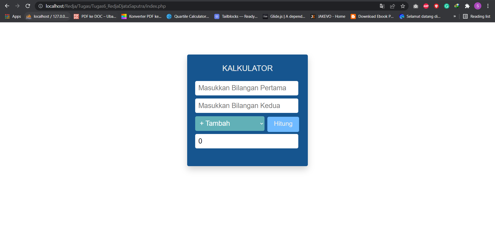

# Kalkulator Sederhana dengan menggunakan PHP dan CSS

## Description

Kalkulator ini menggunakan bahasa pemrograman PHP dan CSS untuk mempercantik tampilan UI. Kalkulator ini mampu menghitung bilangan dengan operasi matematika sederhana yaitu tambah, kurang, kali dan bagi.

## Requirement

- Xampp v3.3.0 || PHP 8.1.2
- Google Chrome 99.0.4844.51

## Output Program

## Credits

Redja Djata Saputra
